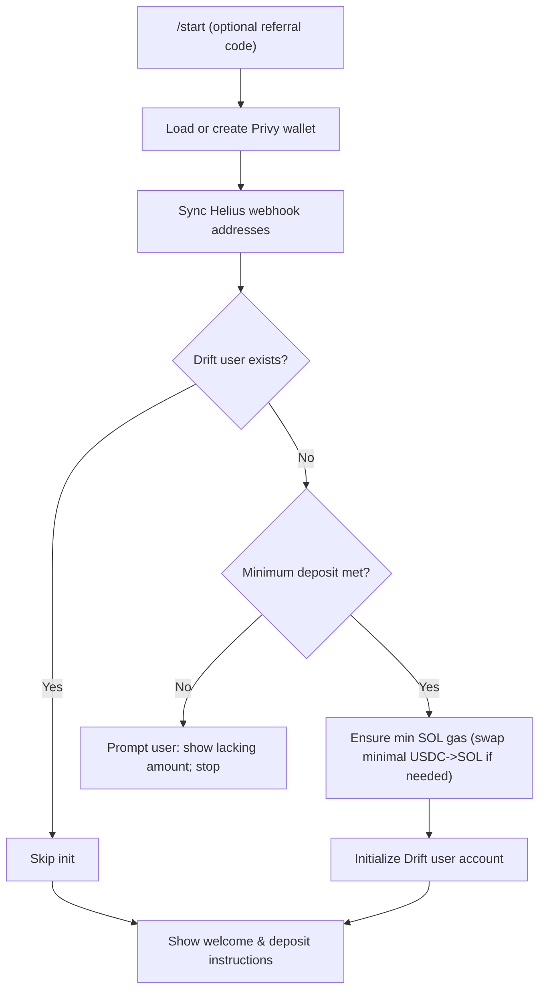
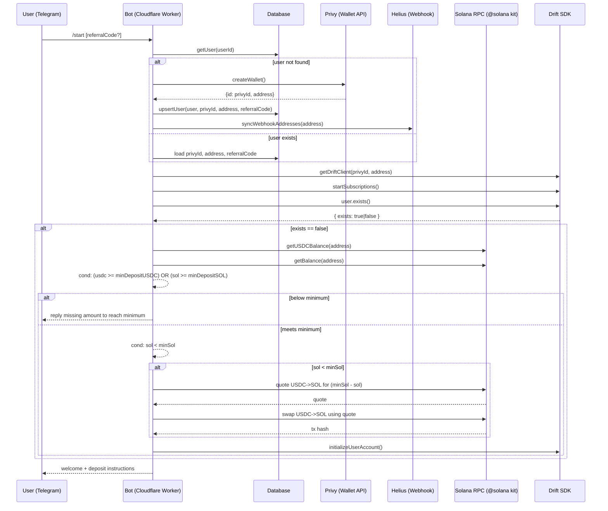
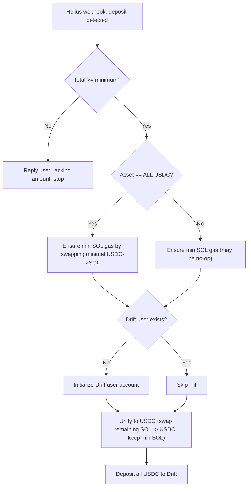
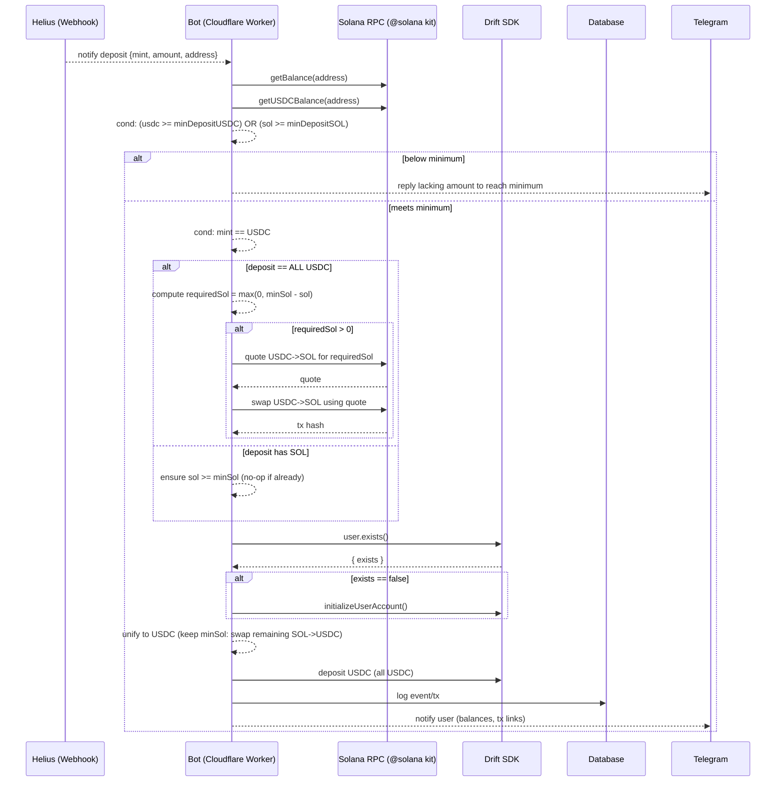
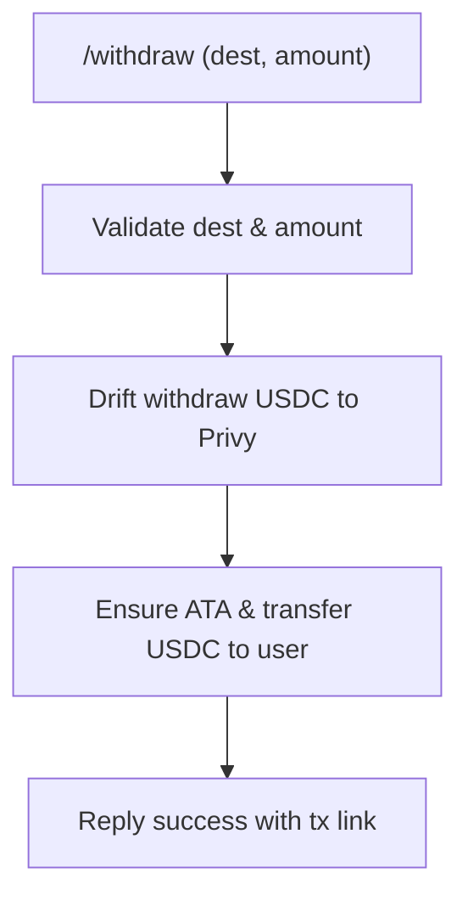
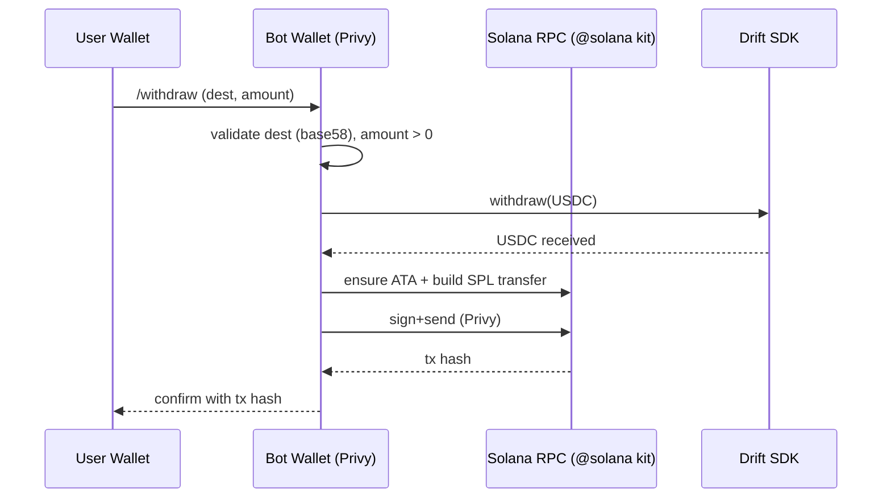

## Daiko Drift Bot Onboarding Flow（仕様案）

このドキュメントは、ユーザーの初回オンボーディングから入出金、ガス管理、資産統一（USDC）までを一貫して扱う最適な体験を定義します。pvp.trade に近い操作性を目標に、まずはシンプルに実装可能な仕様を提示し、将来的な 1tx バンドル等は拡張項目として切り出します。

### 目的（Goals）

- **ガス（SOL）確保**: Drift の `initializeUserAccount()` を実行するために必要最小限の SOL を自動的に確保。
- **資産は USDC に統一**: UX 簡便化のため、入金された資産は原則 USDC に自動スワップ（SOL は最小ガスのみ残す）。
- **入出金導線の単純化**: 入金はユーザーウォレット→Privy（Bot）→Drift、出金は Drift→Privy→ユーザーウォレット。

### 主要エンティティ

- **User Wallet**
- **Bot Wallet**
- **Drift User Account**
- **DB (Cloudflare D1)**
- **RPC (Helius)** = onchain data

### ポリシーとしきい値（抜粋）

- `minSol`: 0.02 SOL 目安（ガス最小残高）
- `targetSol`: 0.03 SOL 目安（ガス目標残高）
- `minDepositUSDC`: 15 USDC 目安（初期化に進む最低額）
- `minDepositSOL`: 0.15 SOL 目安（初期化に進む最低額）
- 入金は SOL/USDC を受け付けるが、オンボーディングの中で最終的に USDC に統一する

---

## コマンド別フロー

### `/start`（リファラルコード対応）

概要

- 既に Drift user があれば初期化はスキップ。
- いなければ最小入金の充足を確認し、満たしていれば最小限のガス（SOL）を確保してから `initializeUserAccount()` を実行。満たしていなければ、不足額を返信して終了。

### フローチャート

### シーケンス（詳細: @Cloudflare Worker, @Drift SDK, @solana kit, @Helius）

入出力（I/O）

- 入力: `referralCode?`
- 読み取り: DB（ユーザー/ウォレット）、RPC（SOL/USDC 残高）
- 副作用: Privy ウォレット作成、Helius アドレス同期、Drift user 初期化、ガス確保（USDC→SOL スワップ）

---

### `/deposit`（入金）

概要

- 入金は Helius Webhook で検知。最低入金を満たさない場合は、不足額を返信して終了。
- 充足していれば、（全 USDC のときは）init 前に最小 USDC→SOL スワップでガスを確保。
- Drift user が未作成なら init。以降は USDC に統一して、全 USDC を Drift に deposit。

### フローチャート

### シーケンス（詳細）

---

### `/withdraw`（出金: Drift → User Wallet）

概要

- 出金は **USDC のみ** 対応。Drift から USDC を受け、ユーザー ATA を確保して SPL トークン転送する。

### フローチャート

### シーケンス（詳細）

---

## 自動スワップ/ガス方針

- **ガス最小残高**: `minSol`（例: 0.02）未満なら、USDC→SOL を自動実行して補充。
- **資産統一**: 入金された SOL は `targetSol`（例: 0.03）を超える分を USDC に自動スワップ。
- **スリッページ**: `slippageBps` を設定（初期 50 = 0.5%）。Quote に基づき `minOut` を尊重。
- **手数料/優先料金**: Jupiter の `dynamicComputeUnitLimit` と `prioritizationFeeLamports: auto` を使用。

---

## エラー処理・リカバリ

- RPC エラー: リトライ戦略（指数バックオフ）、ユーザーへの再実行案内。
- スワップ失敗: Quote 取り直し、スリッページ拡大の提案、または最小金額での再試行。
- Drift アカウント未初期化: `/start` 誘導とガス残高不足の明示。
- アドレス検証: base58/ED25519 検証、USDC 送金時は ATA の作成を安全に実行。

---

## セキュリティ・運用

- Privy サーバーウォレットの署名は最小権限で実行。監査用ログ（tx hash、金額、先方アドレス）を記録。
- Helius Webhook 等で入金検知を一元管理。重複通知ガード。
- スワップ上限・一回当たりの最小/最大金額のガードレール設定。

---

## 将来拡張（スコープ外）

- 1tx バンドル（Drift withdraw + SPL Transfer / SOL Transfer を単一トランザクションに集約）。
- 自動入金→即時 deposit（ポリシーフラグ化、しきい値超過時のみ）。
- 価格情報の厳密化（Drift オラクル/Jupiter 見積りを用いた USDC 金額決定）。
- 失敗時の自動ロールバック/アラート。

---

## 開発メモ（実装の目安）

- Gas 管理: `ensureMinSolBalance(privyId, walletAddress, { minSol, targetSol, usdcTopUp })`
- スワップ: Jupiter v6 `quote`→`swap` で v0 トランザクションを取得し、Privy 署名→送信。
- Drift 操作: `deposit(USDC)` / `withdraw(USDC)` を基本とし、perp 取引の担保は USDC。

---

補足:

- `/start` コマンドは引数にリファラルコードを受け取り、ユーザー作成時に `referralCode` を保存します。
- すべての外部呼び出しは @Cloudflare Worker 上のサーバーハンドラ経由で行われ、@solana kit の接続、@Drift SDK のクライアント、@Helius Webhook 同期を使用します。
