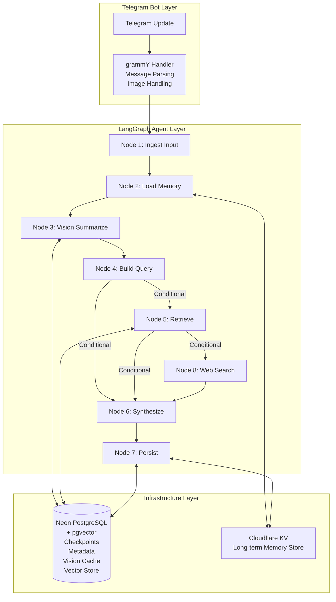
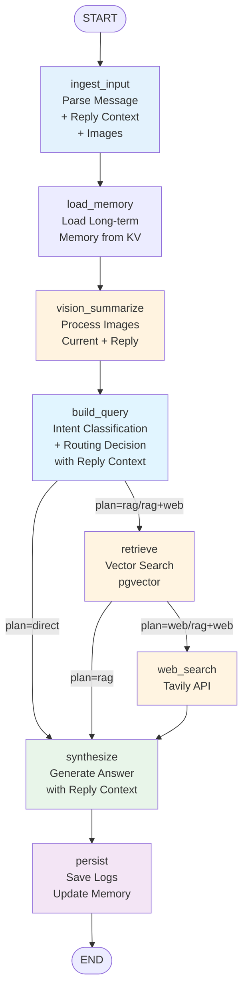
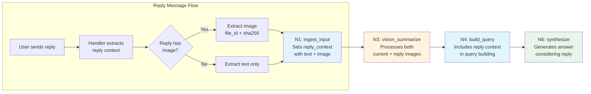
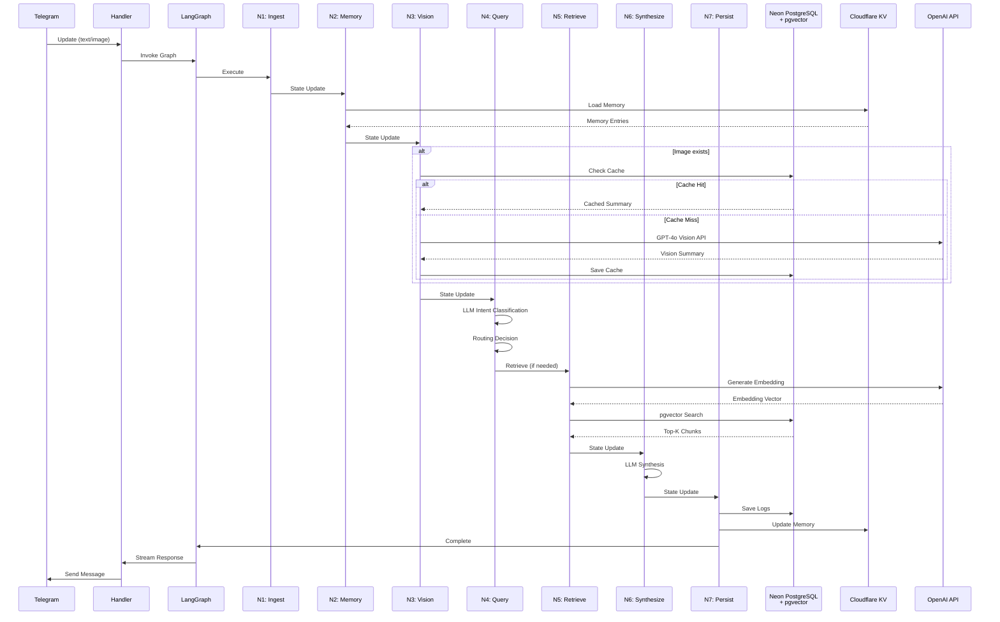
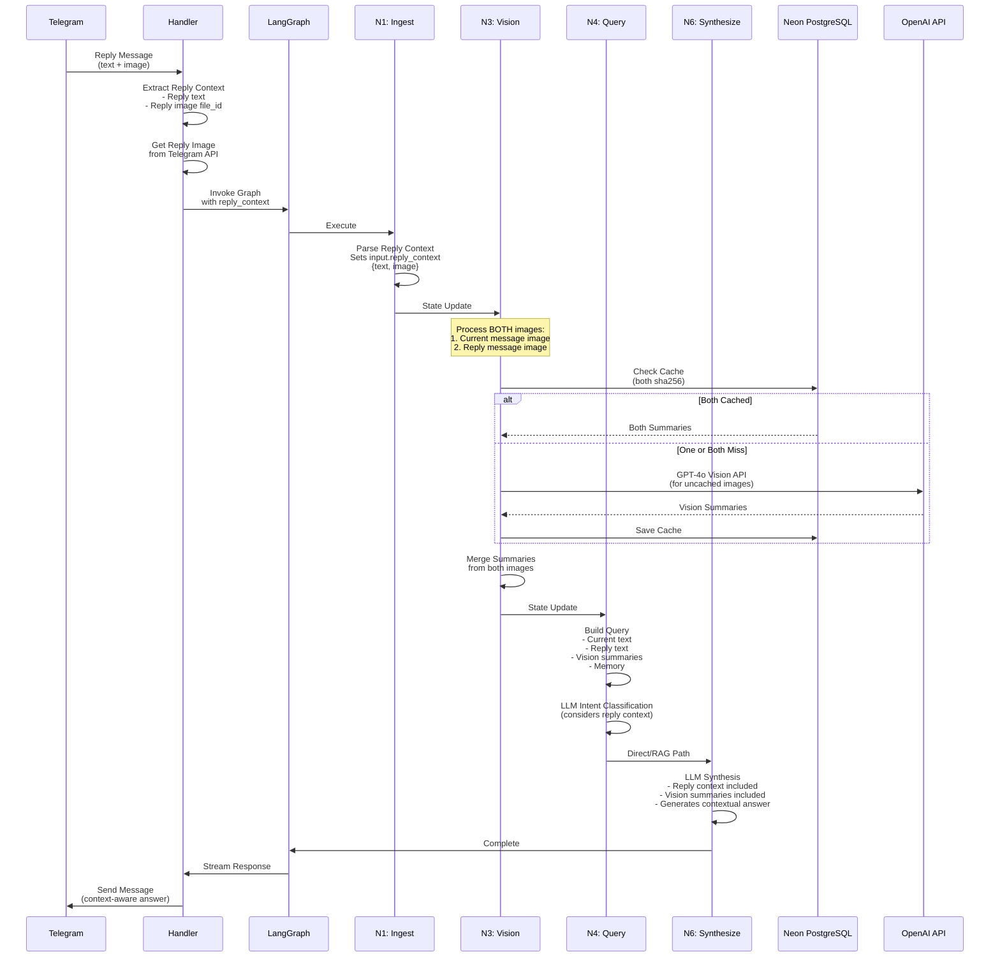

# rich-agent - Technical Design

## 1. 概要

本ドキュメントは、Telegram Bot上でRAG（Retrieval-Augmented Generation）とVision機能を備えた対話エージェントを実装するための技術設計書です。LangGraph.jsのGraph構造を基盤とし、Cloudflare Workers環境で実行されます。

## 2. アーキテクチャパターンと境界マップ

### 2.1 アーキテクチャパターン

**採用パターン**: Sequential Node Flow with Conditional Edges

- LangGraph.jsの`StateGraph`を使用したノードベースのワークフロー
- 各ノードは独立した処理単位として実装され、Stateを更新
- Conditional edgesにより、retrieval decisionやWeb検索の必要性に基づいて動的に分岐
- Checkpointerにより各ノード境界でStateを永続化

### 2.2 システム境界



### 2.3 外部依存関係

- **OpenAI API**: GPT-4o Visionモデル（画像要約）
- **Tavily Search API**: Web検索と引用取得
- **Cloudflare Services**: Vectorize, KV, Workers AI
- **Neon PostgreSQL**: Checkpointer、メタデータ、Visionキャッシュ、RAGデータ

## 3. 技術スタックと整合性

### 3.1 コア技術スタック

| カテゴリ | 技術 | バージョン/設定 | 用途 |
|---------|------|----------------|------|
| AI Framework | LangGraph.js | ^0.3.12 | Graph実行エンジン |
| LLM Provider | OpenAI | GPT-4o, GPT-4o-mini | テキスト生成、Vision要約 |
| Embeddings | OpenAI | text-embedding-3-small | ベクトル埋め込み生成 |
| Vector Store | Neon PostgreSQL + pgvector | @langchain/community/vectorstores/neon | RAG検索（pgvector拡張使用） |
| Database | Neon PostgreSQL | Serverless PostgreSQL | Checkpointer、メタデータ、会話ログ、Visionキャッシュ、RAGデータ、ベクトルストア |
| Checkpointer | @langchain/langgraph-checkpoint-postgres | PostgresSaver | State永続化 |
| Key-Value Store | Cloudflare KV | - | 長期メモリ |
| Search API | Tavily | - | Web検索 |
| Bot Framework | grammY | ^1.38.4 | Telegram Bot処理 |
| Web Framework | Hono | ^4.11.1 | HTTPルーティング |
| ORM | Drizzle ORM | ^0.44.7 | PostgreSQL操作 |

### 3.2 既存コードベースとの整合性

- **既存パターン**: `src/agents/telegram/`構造を拡張
- **State管理**: `graph-state.ts`のAnnotationパターンを継承
- **データベース**: Drizzle ORMスキーマパターンに準拠
- **エラーハンドリング**: `neverthrow` Result型を使用

## 4. コンポーネントとインターフェース契約

### 4.1 Graph State Schema

**ファイル**: `src/agents/telegram/graph-state.ts`

```typescript
export const graphState = Annotation.Root({
  // Short-term memory (checkpointerで永続化)
  messages: Annotation<BaseMessage[]>({
    reducer: messagesStateReducer,
    default: () => [],
  }),

  // User context
  user: Annotation<{
    telegram_user_id: string;
    locale?: string;
  } | null>({
    reducer: (oldValue, newValue) => newValue ?? oldValue,
    default: () => null,
  }),

  // Input normalization
  input: Annotation<{
    text?: string;
    image?: {
      file_id: string;
      sha256: string;
      url?: string;
    };
    reply_context?: {
      message_id: number;
      text?: string;
      image?: {
        file_id: string;
        sha256: string;
        url?: string;
      };
    };
  } | null>({
    reducer: (oldValue, newValue) => newValue ?? oldValue,
    default: () => null,
  }),

  // Vision processing
  vision: Annotation<{
    summary?: {
      summary: string;
      entities: string[];
      tables: string[];
      warnings: string[];
    };
    image_id?: string;
    cached?: boolean;
  }>({
    reducer: (oldValue, newValue) => ({ ...oldValue, ...newValue }),
    default: () => ({}),
  }),

  // RAG processing
  rag: Annotation<{
    query?: string;
    retrieved_chunks?: Array<{
      chunk_id: string;
      content: string;
      source_url: string;
      title: string;
      section: string;
      score: number;
    }>;
    citations?: Array<{
      chunk_id: string;
      url: string;
      section: string;
      snippet: string;
    }>;
  }>({
    reducer: (oldValue, newValue) => ({ ...oldValue, ...newValue }),
    default: () => ({}),
  }),

  // Long-term memory
  memory: Annotation<{
    long_term_entries?: Array<{
      key: string;
      value: unknown;
      namespace: string[];
    }>;
    updated?: boolean;
  }>({
    reducer: (oldValue, newValue) => ({ ...oldValue, ...newValue }),
    default: () => ({}),
  }),

  // Routing decision
  routing: Annotation<{
    intent?: "smalltalk_or_short" | "general_question" | "domain_solana_defi_trade" | "about_this_bot" | "docs_required";
    plan?: "direct" | "rag" | "web" | "rag+web";
    decision_log_id?: string;
  }>({
    reducer: (oldValue, newValue) => ({ ...oldValue, ...newValue }),
    default: () => ({}),
  }),

  // Final answer
  answer: Annotation<{
    text?: string;
    citations?: Array<{
      url: string;
      section: string;
      chunk_id: string;
    }>;
    debug?: unknown;
  }>({
    reducer: (oldValue, newValue) => ({ ...oldValue, ...newValue }),
    default: () => ({}),
  }),
});
```

**要件マッピング**: 6.1 (Stateスキーマ要件)

### 4.2 Node実装

#### N1_ingest_input

**ファイル**: `src/agents/telegram/nodes/ingest-input.ts`

**責任**: Telegram updateを正規化し、Stateの`input`フィールドを設定

**インターフェース**:
```typescript
export const ingestInputNode = async (
  state: typeof graphState.State,
  config: { configurable?: { thread_id?: string } }
): Promise<Partial<typeof graphState.State>>
```

**処理フロー**:
1. Telegram message/photo/replyを解析
2. 現在のメッセージの画像がある場合、`file_id`を取得し、sha256を計算
3. Reply contextがある場合:
   - Reply先メッセージのテキストを取得し、`reply_context.text`に設定
   - Reply先メッセージに画像がある場合、`file_id`を取得し、sha256を計算して`reply_context.image`に設定
4. `input`フィールドを更新

**要件マッピング**: REQ-TG-1, REQ-TG-2, REQ-TG-3

#### N2_load_long_term_memory

**ファイル**: `src/agents/telegram/nodes/load-memory.ts`

**責任**: KV Storeからuser namespaceの長期メモリを取得

**インターフェース**:
```typescript
export const loadLongTermMemoryNode = async (
  state: typeof graphState.State,
  config: { configurable?: { thread_id?: string } }
): Promise<Partial<typeof graphState.State>>
```

**処理フロー**:
1. `thread_id`から`telegram_user_id`を抽出
2. KV namespace `["users", "tg:{user_id}"]`から全エントリを取得
3. `memory.long_term_entries`を更新

**要件マッピング**: REQ-MEM-3, REQ-MEM-5

#### N3_vision_summarize

**ファイル**: `src/agents/telegram/nodes/vision-summarize.ts`

**責任**: 画像入力がある場合、Vision要約を生成（キャッシュ優先）

**インターフェース**:
```typescript
export const visionSummarizeNode = async (
  state: typeof graphState.State
): Promise<Partial<typeof graphState.State>>
```

**処理フロー**:
1. `input.image`または`input.reply_context?.image`が存在するか確認（なければスキップ）
2. 各画像について:
   - Neon PostgreSQLで`image_sha256`をキーにキャッシュを検索
   - キャッシュがあればそれを返却
   - なければGPT-4o Vision APIを呼び出し
   - 結果をNeon PostgreSQLにキャッシュ
3. 複数画像がある場合、要約を統合
4. `vision`フィールドを更新（`summary`、`image_id`、`cached`）

**要件マッピング**: REQ-VIS-1, REQ-VIS-2, REQ-VIS-3

#### N4_build_effective_query

**ファイル**: `src/agents/telegram/nodes/build-query.ts`

**責任**: ユーザーテキスト、Vision要約、長期メモリを統合して検索クエリを生成し、routing decisionを実施

**インターフェース**:
```typescript
export const buildEffectiveQueryNode = async (
  state: typeof graphState.State
): Promise<Partial<typeof graphState.State>>
```

**処理フロー**:
1. `input.text`、`input.reply_context?.text`、`vision.summary`、`memory.long_term_entries`を統合
2. Reply contextがある場合、その内容もcontextに含める
3. LLM（GPT-4o-mini）でintent分類とretrieval decisionを実施
4. `routing.intent`と`routing.plan`を設定
5. 検索クエリを`rag.query`に設定（reply contextも考慮）

**要件マッピング**: REQ-ROUTE-1, REQ-ROUTE-2, REQ-ROUTE-3, REQ-ROUTE-4, REQ-ROUTE-5, REQ-RAG-6

#### N5_retrieve

**ファイル**: `src/agents/telegram/nodes/retrieve.ts`

**責任**: ベクトル検索によりtop-K chunkを取得

**インターフェース**:
```typescript
export const retrieveNode = async (
  state: typeof graphState.State
): Promise<Partial<typeof graphState.State>>
```

**処理フロー**:
1. `routing.plan`が"rag"または"rag+web"の場合のみ実行
2. `rag.query`をOpenAI Embeddings APIでembeddingに変換
3. Neon PostgreSQL（pgvector拡張）で類似度検索（top-K=5）
4. 結果を`rag.retrieved_chunks`に設定

**実装例**:
```typescript
import { NeonPostgres } from "@langchain/community/vectorstores/neon";
import { OpenAIEmbeddings } from "@langchain/openai";

export const retrieveNode = async (
  state: typeof graphState.State
): Promise<Partial<typeof graphState.State>> => {
  const plan = state.routing?.plan;
  if (plan !== "rag" && plan !== "rag+web") {
    return {};
  }

  const query = state.rag?.query;
  if (!query) {
    return {};
  }

  // Initialize vector store
  const embeddings = new OpenAIEmbeddings({
    modelName: "text-embedding-3-small",
    apiKey: process.env.OPENAI_API_KEY,
  });

  const vectorStore = await NeonPostgres.initialize(embeddings, {
    connectionString: process.env.NEON_DATABASE_URL!,
  });

  // Perform similarity search
  const results = await vectorStore.similaritySearch(query, 5);

  // Transform results to retrieved_chunks format
  const retrievedChunks = results.map((doc, index) => ({
    chunk_id: doc.metadata.chunk_id,
    content: doc.pageContent,
    source_url: doc.metadata.source_url,
    title: doc.metadata.title,
    section: doc.metadata.section,
    score: doc.metadata.score || 1 - index * 0.1, // Fallback score
  }));

  return {
    rag: {
      ...state.rag,
      retrieved_chunks: retrievedChunks,
    },
  };
};
```

**要件マッピング**: REQ-RAG-4

#### N6_synthesize

**ファイル**: `src/agents/telegram/nodes/synthesize.ts`

**責任**: 回答生成（引用を付与）

**インターフェース**:
```typescript
export const synthesizeNode = async (
  state: typeof graphState.State
): Promise<Partial<typeof graphState.State>>
```

**処理フロー**:
1. `messages`、`rag.retrieved_chunks`、`vision.summary`、`input.reply_context`を統合
2. Reply contextがある場合、その内容もcontextに含めて回答生成
3. LLM（GPT-4o-mini）で回答生成
4. 引用を抽出し、`answer.citations`に設定
5. `answer.text`を設定

**要件マッピング**: REQ-RAG-4, REQ-TOOL-2

#### N7_persist

**ファイル**: `src/agents/telegram/nodes/persist.ts`

**責任**: 会話ログ保存と長期メモリ更新

**インターフェース**:
```typescript
export const persistNode = async (
  state: typeof graphState.State
): Promise<Partial<typeof graphState.State>>
```

**処理フロー**:
1. 会話ログをNeon PostgreSQLの`messages`テーブルに保存
2. 対話からfacts/preferences/tasksを抽出
3. KV Storeの`["users", "tg:{user_id}"]`namespaceに保存/更新
4. `memory.updated = true`を設定

**要件マッピング**: REQ-MEM-4

#### N8_web_search

**ファイル**: `src/agents/telegram/nodes/web-search.ts`

**責任**: Web検索（Tavily）により外部根拠を取得

**インターフェース**:
```typescript
export const webSearchNode = async (
  state: typeof graphState.State
): Promise<Partial<typeof graphState.State>>
```

**処理フロー**:
1. `routing.plan`が"web"または"rag+web"の場合のみ実行
2. Tavily Search APIを呼び出し
3. 結果を`rag.retrieved_chunks`に追加（既存のRAG結果と統合）
4. 引用を`rag.citations`に追加

**要件マッピング**: REQ-TOOL-1, REQ-TOOL-2, REQ-TOOL-3

### 4.3 Graph構造とEdges

**ファイル**: `src/agents/telegram/index.ts`

```typescript
import { PostgresSaver } from "@langchain/langgraph-checkpoint-postgres";

export async function initAgent(userId: number) {
  const workflow = new StateGraph(graphState)
    .addNode("ingest_input", ingestInputNode)
    .addNode("load_memory", loadLongTermMemoryNode)
    .addNode("vision_summarize", visionSummarizeNode)
    .addNode("build_query", buildEffectiveQueryNode)
    .addNode("retrieve", retrieveNode)
    .addNode("web_search", webSearchNode)
    .addNode("synthesize", synthesizeNode)
    .addNode("persist", persistNode)

    // Sequential edges
    .addEdge(START, "ingest_input")
    .addEdge("ingest_input", "load_memory")
    .addEdge("load_memory", "vision_summarize")
    .addEdge("vision_summarize", "build_query")

    // Conditional edge: retrieval decision
    .addConditionalEdges(
      "build_query",
      (state: typeof graphState.State) => {
        const plan = state.routing?.plan;
        if (plan === "direct") return "synthesize";
        if (plan === "rag" || plan === "rag+web") return "retrieve";
        return "synthesize";
      },
      {
        retrieve: "retrieve",
        synthesize: "synthesize",
      }
    )

    // Conditional edge: web search decision
    .addConditionalEdges(
      "retrieve",
      (state: typeof graphState.State) => {
        const plan = state.routing?.plan;
        if (plan === "rag+web" || plan === "web") return "web_search";
        return "synthesize";
      },
      {
        web_search: "web_search",
        synthesize: "synthesize",
      }
    )

    .addEdge("web_search", "synthesize")
    .addEdge("synthesize", "persist")
    .addEdge("persist", END);

  // Initialize PostgreSQL checkpointer
  const checkpointer = PostgresSaver.fromConnString(process.env.NEON_DATABASE_URL!);
  await checkpointer.setup();

  const graph = workflow.compile({
    checkpointer,
  });

  return { graph, config: { configurable: { thread_id: `tg:${userId}` } } };
}
```

**Graph構造図**:



**Replyケースの処理フロー**:



**要件マッピング**: 6.2 (Nodeセット), 6.3 (制御フロー)

### 4.4 Checkpointer実装

**ファイル**: `src/agents/telegram/checkpointer/postgres-checkpointer.ts`

**責任**: Neon PostgreSQLをバックエンドとするcheckpointer実装

**実装**:
```typescript
import { PostgresSaver } from "@langchain/langgraph-checkpoint-postgres";

// PostgresSaverは@langchain/langgraph-checkpoint-postgresから提供
// Neon PostgreSQL接続文字列を使用
const checkpointer = PostgresSaver.fromConnString(process.env.NEON_DATABASE_URL!);

// 初回セットアップ（テーブル作成）
await checkpointer.setup();
```

**データベーススキーマ**: `@langchain/langgraph-checkpoint-postgres`が自動的に作成
- `checkpoints`: thread_id, checkpoint_id, checkpoint_data (JSONB), parent_checkpoint_id, metadata (JSONB), created_at
- `checkpoint_blobs`: 大きなcheckpointデータ用（オプション）

**要件マッピング**: REQ-MEM-1, REQ-MEM-2, REQ-DUR-1

### 4.5 KV Store実装

**ファイル**: `src/agents/telegram/store/kv-store.ts`

**責任**: Cloudflare KVをバックエンドとする長期メモリStore実装

**インターフェース**:
```typescript
import { BaseStore } from "@langchain/langgraph";

export class KVStore extends BaseStore {
  constructor(private kv: KVNamespace) {
    super();
  }

  async mget(keys: Array<[string[], string]>): Promise<Array<unknown>>;
  async mset(keyValuePairs: Array<[string[], unknown]>): Promise<void>;
  async mdelete(keys: Array<[string[], string]>): Promise<void>;
  async yieldKeys(prefix?: string[]): AsyncGenerator<string[], void, unknown>;
}
```

**Namespace形式**: `["users", "tg:{telegram_user_id}", "{key}"]`

**要件マッピング**: REQ-MEM-3, REQ-MEM-4, REQ-MEM-5

### 4.6 RAGデータスキーマ

**ファイル**: `src/db/schema/rag.ts`

#### document_sources
- `id`: VARCHAR PRIMARY KEY
- `type`: VARCHAR (`"url_list"` | `"sitemap"` | `"local_file"`)
- `root_url`: VARCHAR
- `status`: VARCHAR (`"active"` | `"inactive"`)
- `updated_at`: TIMESTAMP

#### documents
- `id`: VARCHAR PRIMARY KEY
- `source_id`: VARCHAR (FK)
- `url`: VARCHAR
- `title`: VARCHAR
- `fetched_at`: TIMESTAMP
- `content_hash`: VARCHAR
- `raw_text`: TEXT

#### chunks
- `id`: VARCHAR PRIMARY KEY
- `document_id`: VARCHAR (FK)
- `section`: VARCHAR
- `chunk_index`: INTEGER
- `content`: TEXT
- `token_count`: INTEGER
- `content_hash`: VARCHAR

#### embeddings
- `id`: VARCHAR PRIMARY KEY
- `chunk_id`: VARCHAR (FK)
- `embedding`: VECTOR(1536) (pgvector拡張、OpenAI text-embedding-3-smallの次元数)
- `model`: VARCHAR
- `created_at`: TIMESTAMP

**pgvector拡張の設定**:
- Neon PostgreSQLで`pgvector`拡張を有効化: `CREATE EXTENSION IF NOT EXISTS vector;`
- インデックス作成: `CREATE INDEX ON embeddings USING ivfflat (embedding vector_cosine_ops);`

**要件マッピング**: 7.2 (RAGデータ要件)

### 4.7 Visionキャッシュスキーマ

**ファイル**: `src/db/schema/vision.ts`

#### images
- `id`: VARCHAR PRIMARY KEY
- `telegram_file_id`: VARCHAR
- `sha256`: VARCHAR UNIQUE
- `mime`: VARCHAR
- `size`: INTEGER
- `created_at`: TIMESTAMP

#### image_summaries
- `id`: VARCHAR PRIMARY KEY
- `image_id`: VARCHAR (FK)
- `model`: VARCHAR
- `summary_json`: JSONB
- `created_at`: TIMESTAMP

**要件マッピング**: 7.4 (Visionキャッシュ要件), REQ-VIS-2

### 4.8 Telegram Handler拡張

**ファイル**: `src/bot/handler.ts`

**変更点**:
1. 画像メッセージの処理を追加
2. Reply contextの処理を追加（テキストと画像の両方）
3. Reply先メッセージの画像取得と処理
4. ストリーミング応答の改善（typing indicator、部分テキスト送信）

**インターフェース**:
```typescript
const handleMessage = async (ctx: Context) => {
  const userMessage = ctx.message?.text;
  const photo = ctx.message?.photo;
  const replyToMessage = ctx.message?.reply_to_message;
  
  // Reply contextの処理
  let replyContext: {
    message_id: number;
    text?: string;
    image?: { file_id: string; sha256: string };
  } | undefined;
  
  if (replyToMessage) {
    replyContext = {
      message_id: replyToMessage.message_id,
      text: replyToMessage.text,
    };
    
    // Reply先メッセージに画像がある場合
    if (replyToMessage.photo) {
      const replyPhoto = replyToMessage.photo[replyToMessage.photo.length - 1];
      const file = await ctx.api.getFile(replyPhoto.file_id);
      // sha256計算とfile_id保存
      replyContext.image = {
        file_id: replyPhoto.file_id,
        sha256: await calculateSha256(file),
      };
    }
  }
  
  // 現在のメッセージの画像処理
  let image: { file_id: string; sha256: string } | undefined;
  if (photo) {
    const file = await ctx.api.getFile(photo[photo.length - 1].file_id);
    image = {
      file_id: photo[photo.length - 1].file_id,
      sha256: await calculateSha256(file),
    };
  }
  
  // Graph実行とストリーミング
  const { graph, config } = await initAgent(userId);
  const stream = await graph.stream({
    messages: [new HumanMessage(userMessage || "")],
    input: {
      text: userMessage,
      image,
      reply_context: replyContext,
    },
  }, config);
  
  await processGraphStream(stream, content => ctx.reply(content));
};
```

**要件マッピング**: REQ-TG-1, REQ-TG-2, REQ-TG-3, REQ-TG-4

## 5. データフローと統合ポイント

### 5.1 メッセージ処理フロー

**通常メッセージフロー**:



**Replyメッセージフロー（画像含む）**:



### 5.2 外部API統合

- **OpenAI Vision API**: `N3_vision_summarize`で使用
- **OpenAI Embeddings API**: `N5_retrieve`で使用（text-embedding-3-small）
- **Tavily Search API**: `N8_web_search`で使用
- **Neon PostgreSQL + pgvector**: `N5_retrieve`で使用（ベクトル検索）
- **Cloudflare KV**: `N2_load_memory`、`N7_persist`で使用
- **Neon PostgreSQL**: Checkpointer、メタデータ、Visionキャッシュ、RAGデータ、ベクトルストアで使用

## 6. エラーハンドリングと回復

### 6.1 エラー戦略

- **Node失敗**: try-catchでエラーを捕捉し、Stateにエラー情報を記録
- **外部API失敗**: リトライロジック（指数バックオフ）を実装
- **Checkpoint失敗**: エラーログを記録し、次のcheckpointで再試行

### 6.2 Idempotency保証

- **Vision処理**: sha256キャッシュにより同一画像の再推論を回避
- **RAG検索**: クエリとStateのハッシュにより結果をキャッシュ可能
- **Web検索**: クエリハッシュにより結果をキャッシュ可能

**要件マッピング**: REQ-DUR-2, NFR-IDEMP-1

## 7. パフォーマンスとスケーラビリティ

### 7.1 最適化戦略

- **Visionキャッシュ**: sha256ベースのキャッシュでコスト削減（REQ-VIS-2）
- **差分埋め込み**: content_hash比較により変更chunkのみ再埋め込み（REQ-RAG-5）
- **並列処理**: Vision要約とRAG準備を並列実行可能
- **ストリーミング**: 中間出力を逐次送信してUX向上（REQ-TG-4）

### 7.2 リソース制約

- **Cloudflare Workers**: CPU時間制限（10ms-50s）
- **KV**: 値サイズ制限（25MB）
- **Neon PostgreSQL**: 接続数制限、ストレージ制限（プラン依存）
- **pgvector**: ベクトル次元数制限（最大16,000次元、OpenAIは1536次元）
- **OpenAI Embeddings API**: レート制限、トークン制限

## 8. セキュリティとプライバシー

### 8.1 データ保護

- **User Isolation**: thread_idによる完全な分離（REQ-TG-1）
- **API Keys**: 環境変数で管理、ソース管理にコミットしない（NFR-DEP-2）
- **画像データ**: Telegram file_idのみ保存、生画像は一時的にのみ保持

### 8.2 入力検証

- **Telegram Update**: grammYの型安全性を活用
- **State更新**: Annotation reducerによる型安全な更新

## 9. 観測可能性

### 9.1 ログ記録

- **Node実行**: 各ノードの開始/終了、所要時間を記録（NFR-OBS-1）
- **Retrieval Decision**: routing decisionとその根拠を記録（REQ-TOOL-3）
- **エラー**: 構造化ログでエラー詳細を記録

### 9.2 メトリクス

- **Retrieval件数**: `rag.retrieved_chunks.length`
- **Visionキャッシュヒット率**: cached vs uncached
- **Response時間**: 各ノードの実行時間

## 10. テスト戦略

### 10.1 単体テスト

- **各Node**: モックStateで個別にテスト
- **Checkpointer**: PostgreSQLモックでテスト
- **KV Store**: KVモックでテスト

### 10.2 統合テスト

- **Graph実行**: 実際のNeon PostgreSQL/Vectorize/KVでテスト
- **エンドツーエンド**: Telegram Botシミュレーション

## 11. デプロイメントと設定

### 11.1 環境変数

- `OPENAI_API_KEY`: GPT-4o Vision API、Embeddings API
- `TAVILY_API_KEY`: Tavily Search API
- `NEON_DATABASE_URL`: Neon PostgreSQL接続文字列（pgvector拡張有効）
- `KV_STORE`: KV namespace名

### 11.2 Cloudflare設定

- **wrangler.toml**: KVバインディングを設定
- **Worker Bindings**: KVサービスへのアクセスを設定
- **Neon PostgreSQL**: 環境変数で接続文字列を管理
- **pgvector拡張**: Neon PostgreSQLで`CREATE EXTENSION vector;`を実行

**要件マッピング**: NFR-DEP-1, NFR-DEP-2

## 12. 将来の拡張性

### 12.1 拡張ポイント

- **追加ノード**: カスタム処理ノードの追加が容易
- **追加ツール**: LangChain ToolNodeパターンで外部ツール統合
- **Interrupt/Resume**: 将来的にhuman-in-the-loop機能を追加可能

### 12.2 制約事項

- **Stateサイズ**: 大きなStateはcheckpointサイズに影響
- **Node数**: ノード数増加はグラフ複雑性に影響
