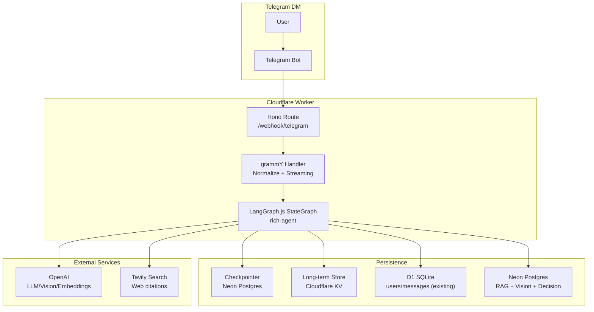
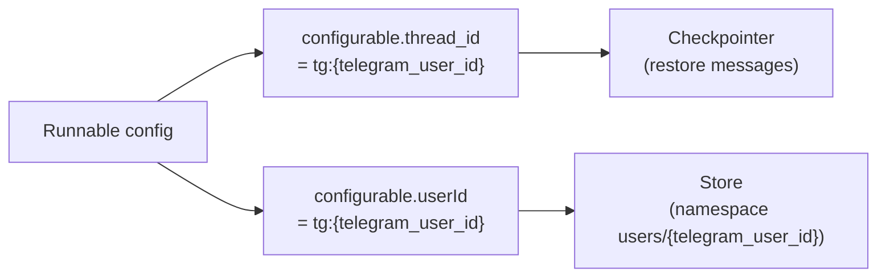
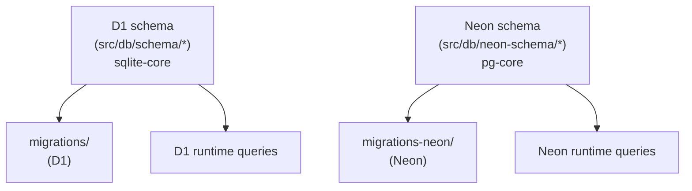
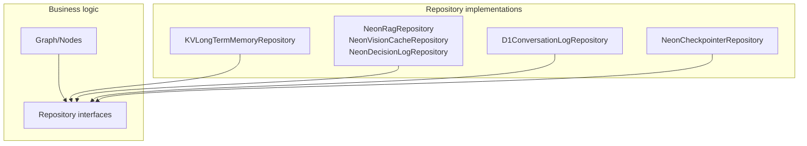

# rich-agent - Technical Design (v4)

> **変更概要 (v4)**
> - 図をMermaidへ統一（読みやすさ改善）
> - Telegram DM（1対1）前提に合わせ、**per-userで会話（short-term）を永続化**するthread設計へ修正
> - `requirements.md` の全要件を満たすため、取り込み/引用/ストリーミング/interrupt/resume/idempotency を具体化
> - **v4.1**: RepositoryパターンによるInfra抽象化を追加（移行手順は削除）

## 1. 概要

Telegram DM（1対1）でユーザーと対話し、(a) 事前登録Docs、(b) ローカル文書、(c) ユーザー画像を根拠に **引用付き回答** を返す。

- **実行モデル**: LangGraph.js `StateGraph`（State / Nodes / Edges）
- **短期メモリ**: checkpointer により `thread_id` 単位で会話履歴を永続化
- **長期メモリ**: Store（Cloudflare KV）に user namespace で JSON を保存
- **ストリーミング**: graph 実行中に「typing」「中間ステータス」「部分テキスト」を送る

## 2. Architecture Pattern & Boundary Map

### 2.1 採用パターン（Mermaid）



### 2.2 DM前提の thread / user の識別

本ユースケースは **ユーザーとBotのDM（1対1）** を前提とし、要件に従い **per-userで会話内容を保持**する。

- **thread_id（short-term）**: `tg:{telegram_user_id}`（固定）
- **userId（long-term Store）**: `tg:{telegram_user_id}`（固定）

> 将来グループ対応する場合は `thread_id` を chat単位に拡張するが、本設計のスコープ外。



## 3. Technology Stack & Alignment

### 3.1 既存コードとの整合（重要）

- 既存のDB層は **D1(SQLite)+Drizzle**（`drizzle.config.ts` は sqlite/d1-http）。
- Neon(Postgres) は **別スキーマ/別migration** として分離する。



### 3.2 Drizzle × Neon（Workers対応）

参照: [Drizzle ORM - Database connection](https://orm.drizzle.team/docs/connect-overview)

- **RAG/Vision/Decision（単発クエリ）**: `drizzle-orm/neon-http`
- **Checkpointer（pg.Pool互換が必要）**: `@neondatabase/serverless` の `Pool`（WebSocket）を `PostgresSaver` に注入

> Workersでは `PostgresSaver.setup()` を実行しない。チェックポインタ用テーブルは **migrations-neon** で事前作成する。

#### 3.2.1 重要: D1(SQLite) と Neon(Postgres) の Drizzle スキーマは分離する

本リポジトリの既存 Drizzle は D1(SQLite) 前提（`drizzle.config.ts` / `drizzle-orm/sqlite-core`）であり、同一 `schema` エントリポイントに **pg-core のテーブル定義を混在**させると、型/マイグレーション/クエリ生成が破綻する。

- **方針**:
  - D1(SQLite) 用スキーマ: 既存の `src/db/schema/*`（sqlite-core）を維持
  - Neon(Postgres) 用スキーマ: 新規に `src/db/neon-schema/*`（pg-core）を作成
  - drizzle-kit 設定も **2つ**に分ける（D1用 / Neon用）

### 3.3 Repository層でインフラ差分を吸収する（シンプル版）

Port/Adapter のような大掛かりな構造にはせず、**Repository層**で Cloudflare 固有依存（KV/D1/Neon/Workers制約）を吸収する。
Business logic（Graph/Nodes）は repository **インターフェース**にのみ依存し、実装は `createRepositories(env)` で組み立てる。



#### 3.3.1 Repository contracts（必要最小限）

```typescript
export interface LongTermMemoryRepository {
  get(namespace: string[], key: string): Promise<Record<string, unknown> | undefined>;
  put(namespace: string[], key: string, value: Record<string, unknown>): Promise<void>;
  search(
    namespacePrefix: string[],
    options?: { limit?: number; offset?: number; query?: string },
  ): Promise<Array<{ key: string; value: Record<string, unknown> }>>;
}

export interface VisionCacheRepository {
  getBySha256(sha256: string): Promise<
    | {
        summary: { summary: string; entities: string[]; tables: unknown[]; warnings: string[] };
      }
    | undefined
  >;
  upsertBySha256(input: {
    sha256: string;
    telegramFileId: string;
    summary: { summary: string; entities: string[]; tables: unknown[]; warnings: string[] };
  }): Promise<void>;
}

export interface RagRepository {
  topK(input: { queryEmbedding: number[]; k: number }): Promise<
    Array<{ chunk_id: string; content: string; source_url: string; title: string; section: string; score: number }>
  >;
  // ingestion用 upsert はCLI側で利用（別途実装）
}

export interface DecisionLogRepository {
  insert(input: {
    thread_id: string;
    intent: string;
    plan: string;
    reason: string;
    retrieved_count: number;
    citations_count: number;
  }): Promise<void>;
}
```

#### 3.3.2 DIポイント（1箇所）


## 4. Components & Interface Contracts

### 4.1 State Schema（REQ 6.1準拠）

Stateは要件の最小フィールドを必ず含む。

- `messages`
- `user`
- `input`
- `vision`
- `rag`
- `memory`
- `routing`
- `answer`

### 4.2 Node契約

- **入力**: `(state, config)`
  - `config.configurable.thread_id`（必須）
  - `config.configurable.userId`（必須）
  - `config.store`（long-term memory）
- **出力**: `Partial<State>`
- **副作用**: すべて **冪等キー** を持ち、再実行しても安全（REQ-DUR-2）

## 5. Graph（Nodes / Edges）

### 5.1 Nodeセット（REQ 6.2準拠）

要件のノードセットを、DM前提の現実実装に落とす（名称は要件準拠の意味を満たす）。

- `N1_ingest_input`
- `N2_load_long_term_memory`
- `N3_vision_summarize`
- `N4_build_effective_query`
- `N5_retrieve`
- `N8_web_search`
- `N6_synthesize`
- `N7_persist`

### 5.2 Edge（REQ 6.3準拠）


## 6. Telegram Inbound & Streaming

### 6.1 Inbound（REQ-TG-1..4）

- テキスト: `ctx.message.text` または `caption`
- 画像: `ctx.message.photo[]` から最大解像度の `file_id`
- reply-to画像: `ctx.message.reply_to_message.photo[]` を解決

**thread_id** は必ず `tg:{telegram_user_id}`（REQ-TG-1 / §2.2）。

### 6.2 Streaming戦略（REQ-TG-4 / NFR-UX-1）

最低限、実行中の応答性を保証する。

- **typing**: 実行開始時に `sendChatAction("typing")` を周期送信（例: 3–5秒ごと）
- **中間ステータス**: ノード境界で「検索中」「要約中」など短文を送信
- **部分テキスト**: `N6_synthesize` がモデルのストリームを利用できる場合、一定間隔で部分文字列を送信


## 7. Vision（REQ-VIS-1..3）

### 7.1 Vision summaryのJSON形状

`{"summary": string, "entities": array, "tables": array, "warnings": array}`

- **生成**: vision対応モデル（GPT-4o）
- **構造化出力**: Zod schema + `withStructuredOutput` を用い、JSON形状を強制

### 7.2 Cache（REQ-VIS-2 / NFR-COST-1）

- **キー**: `image_sha256`
- **保存先**: Neon `vision_images` / `vision_summaries`
- **冪等性**: `sha256` の UNIQUE 制約 + upsert

### 7.3 State格納（REQ-VIS-3）

- `state.vision.summary` に `VisionSummary` を格納

## 8. RAG（Web Docs + Local Docs）（REQ-RAG-1..6）

### 8.1 ソース登録（REQ-RAG-1）

- URL list
- sitemap
- local file

`rag_sources` に type/root_url/status を保存。

### 8.2 正規化（REQ-RAG-2）

Web/Local を同一スキーマへ正規化:
- `rag_documents`
- `rag_chunks`

### 8.3 Chunkメタデータ（REQ-RAG-3）

各chunkには必ず以下を保持:
- `source_url`
- `title`
- `section`
- `chunk_id`

### 8.4 Retrieval + 引用（REQ-RAG-4）

- `N5_retrieve` で top-K chunk を取得
- `N6_synthesize` は回答に引用を明示
  - `source_url + section + chunk_id`

### 8.5 差分取り込み（REQ-RAG-5 / NFR-COST-2 / AC-6）

- `rag_documents.content_hash`
- `rag_chunks.content_hash`

変更がある chunk のみ再埋め込み。


### 8.6 Agentic RAG（REQ-RAG-6）

`N4_build_effective_query` で retrieval decision を行い、
- `direct`
- `rag`
- `web`
- `rag+web`
を決定し、**理由と共に記録**（REQ-TOOL-3 / §11.2）。

## 9. Memory（Short-term + Long-term）（REQ-MEM-1..5）

### 9.1 Short-term（checkpointer）（REQ-MEM-1 / REQ-MEM-2）

- checkpointer: PostgresSaver（Neon）
- thread_id: `tg:{telegram_user_id}`（DM前提の per-user 固定 / REQ-TG-1 / 要件4）
- 再起動後も同一ユーザーの会話を継続（AC-4）

#### 9.1.1 会話肥大化（messages増大）への対策（DM前提の最重要設計）

DMで `thread_id` をユーザー固定にすると、short-term の `messages` が無制限に増え、以下の問題が起きる:
- LLM入力トークン超過（失敗 or コスト急増）
- checkpointサイズ増加（保存/復元の遅延）
- streamingの遅延

そのため、**チェックポイントの「論理的な会話文脈」を保ちつつ、messagesを圧縮**する「コンパクション」を導入する。

**基本方針（段階的）**:
- **Phase A（必須）**: message windowing（最新N件のみを状態に残す）
- **Phase B（推奨）**: conversation summary をStateへ昇格（要約を system context として保持）
- **Phase C（拡張）**: 古い会話をNeon/D1へアーカイブし、必要時のみ取り出す


**Stateへの追加（コンパクション用）**:
- `memory.conversation_summary?: string`（短期の要約）
- `memory.summary_updated_at?: string`

**コンパクションの実行ポイント**:
- `N7_persist` の最後（対話完了時）で、一定条件なら `conversation_summary` を更新し `messages` を縮退する
- もしくは `N1_ingest_input` の直後に「budget check node」を追加し、常に安全な状態で次へ進む

**コンパクション条件（例）**:
- `messages` の推定トークンが `MAX_CONTEXT_TOKENS` を超える
- 直近Kターン以外は要約に含めて削る（K=10など）

### 9.2 Long-term（Store）（REQ-MEM-3..5）

- 本ユースケース（DM 1:1）では、long-term memory は「最小構成」でよい。
- 目的は **会話が肥大化したときに短期Stateを軽く保ちつつ、重要情報だけ残す** こと。

**保存単位（最小）**:
- namespace: `['users', '{telegram_user_id}']`
- keys:
  - `facts`（JSON）
  - `preferences`（JSON）
  - `tasks`（JSON）
  - `conversation_summary`（JSON: `{ summary: string, updated_at: string }`）

**更新タイミング**:
- `N7_persist` で対話完了時に更新（REQ-MEM-4）
- `conversation_summary` は **short-termコンパクション** と同時に更新する（§9.1.1）


**semantic search（REQ-MEM-5）**:
- Storeに `query` が提供される場合、実装は2段階:
  - **Phase 1（必須）**: key/value の prefix/list による取得
  - **Phase 2（拡張）**: Neon(pgvector) で long-term memory embedding を保持し `query` を意味検索

## 10. Durable Execution / Interrupts / Idempotency

### 10.1 Durable execution（REQ-DUR-1）

- checkpointerが state を node 境界で保存し、再起動後も復元

### 10.2 Task分離と冪等性（REQ-DUR-2 / NFR-IDEMP-1）

副作用を伴う処理は「task」として扱い、冪等キーを設計する。

- **Vision**: `image_sha256`
- **Embeddings**: `chunk_id + embedding_model + content_hash`
- **Web fetch / crawl**: `source_id + url + fetched_at_bucket`
- **Decision log**: `thread_id + request_id`

### 10.3 Interrupt/Resume（REQ-INT-1 / NFR-REL-2）

- **入力不足**（例: 画像への質問だが質問文が短すぎる）
- **人手承認**（例: 特定カテゴリの回答を承認待ちにする）

この場合、Graphは `interrupt()` 相当で停止し、
次のユーザーメッセージで同一 `thread_id` から再開する。


## 11. Tooling / Routing（REQ-ROUTE-1..5 / REQ-TOOL-1..3）

### 11.1 Intent分類

分類（最低限）:
- `smalltalk_or_short`
- `general_question`
- `domain_solana_defi_trade`
- `about_this_bot`
- `docs_required`

### 11.2 Decision log（REQ-TOOL-3）

- plan
- reason
- retrieved count
- citations count
- latency summary

保存先: Neon `retrieval_decisions`

## 12. Data Model（永続化要件）（REQ 7.*）

### 12.1 Checkpoints（REQ 7.1）

- `checkpoints`
- `checkpoint_blobs`
- `checkpoint_writes`
- `checkpoint_migrations`

### 12.2 RAG data（REQ 7.2）

- `rag_sources`
- `rag_documents`（`content_hash`, `raw_text`）
- `rag_chunks`（`section`, `chunk_index`, `content_hash`）
- `rag_embeddings`（`model`, `created_at`）

### 12.3 Conversation logs（REQ 7.3）

既存D1の `users/messages` を最低限の監査ログとして利用し、必要なら Neon へ移管。

### 12.4 Vision cache（REQ 7.4）

- `vision_images`
- `vision_summaries`

### 12.5 Long-term memory（REQ 7.5）

KV: namespace に user_id を含め、keyでJSON管理。

## 13. Requirements Traceability（全要件カバレッジ）

- **REQ-TG-1**: §2.2 / §6.1（thread_id=tg:{telegram_user_id}）
- **REQ-TG-2**: §6.1（photo入力をthread入力に紐付け）
- **REQ-TG-3**: §6.1（reply_to_message photo解決）
- **REQ-TG-4**: §6.2（typing/中間/部分テキスト）

- **REQ-VIS-1**: §7.1（JSON形状）
- **REQ-VIS-2**: §7.2（sha256キャッシュ）
- **REQ-VIS-3**: §7.3（State格納）

- **REQ-RAG-1**: §8.1（複数ソース登録）
- **REQ-RAG-2**: §8.2（Web/Local正規化）
- **REQ-RAG-3**: §8.3（chunkメタデータ）
- **REQ-RAG-4**: §8.4（top-K + 引用）
- **REQ-RAG-5**: §8.5（差分取り込み）
- **REQ-RAG-6**: §8.6（retrieval decision + 記録）

- **REQ-MEM-1**: §9.1（checkpointer復元）
- **REQ-MEM-2**: §9.1（DB-backed checkpointer）
- **REQ-MEM-3**: §9.2（namespaceにuser_id）
- **REQ-MEM-4**: §9.2（facts/preferences/tasks更新）
- **REQ-MEM-5**: §9.2（namespace/key取得 + semantic拡張点）

- **REQ-DUR-1**: §10.1
- **REQ-DUR-2**: §10.2
- **REQ-INT-1**: §10.3

- **REQ-ROUTE-1..5**: §11.1
- **REQ-TOOL-1..3**: §11.2 / §8.6

- **REQ 6.1**: §4.1
- **REQ 6.2**: §5.1
- **REQ 6.3**: §5.2

- **REQ 7.1..7.5**: §12

- **NFR-REL-1..2**: §9.1 / §10.3
- **NFR-IDEMP-1**: §10.2
- **NFR-OBS-1**: §11.2（decision log）+ node logging（実装タスクで具体化）
- **NFR-UX-1**: §6.2
- **NFR-COST-1..2**: §7.2 / §8.5
- **NFR-DEP-1..2**: §3.1 / 運用（secrets分離）

## 14. 実装に直結する注意点（DM前提）

- Handlerは `thread_id` を **固定**（`tg:{telegram_user_id}`）し、per-userで短期会話を保持する。
- `userId` も同じ値でよい（DM前提）。
- 図はすべて Mermaid とし、ラベルは必要に応じて `"..."` でクォートする。
