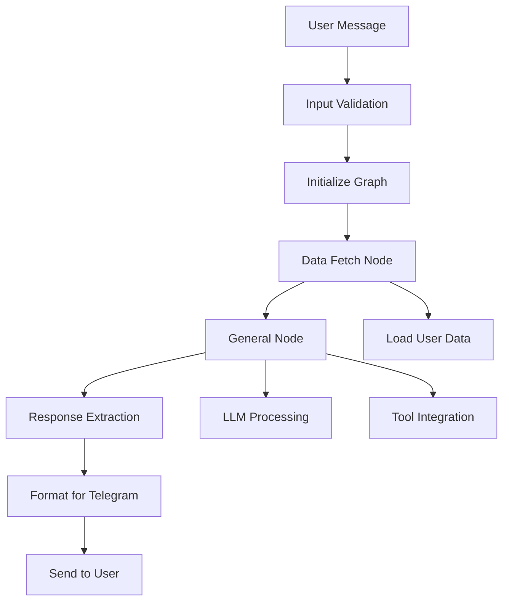

# 🤖 Agents Architecture Documentation

This document describes the architecture and organization of the AI agents system in the Hono LangGraph Telegram Bot project.

## 📁 Directory Structure

```
src/agents/
├── model.ts                    # LLM model configurations
├── telegram/                   # Telegram-specific agent implementation
│   ├── index.ts               # Main agent interface
│   ├── graph.ts               # LangGraph workflow definition
│   ├── graph-state.ts         # State management and annotations
│   ├── graph-route.ts         # Routing logic between nodes
│   ├── nodes/                 # Individual processing nodes
│   │   ├── general.ts         # General conversation node
│   │   ├── data-fetch.ts      # Data fetching node
│   │   └── manager.ts         # Manager/orchestrator node
│   └── prompts/               # Prompt templates
│       ├── general.ts         # General conversation prompts
│       └── manager.ts         # Manager prompts
```

## 🏗️ Architecture Overview

### Core Components

#### 1. **Model Configuration** (`model.ts`)
- **Purpose**: Centralized LLM model configurations
- **Responsibilities**:
  - Define OpenAI and Groq model instances
  - Manage API keys and model parameters
  - Provide consistent model access across agents

```typescript
export const gpt4o = new ChatOpenAI({
  modelName: "gpt-4o",
  temperature: 0.7,
  apiKey: process.env.OPENAI_API_KEY,
});

export const gpt4oMini = new ChatOpenAI({
  modelName: "gpt-4o-mini", 
  temperature: 0.7,
  apiKey: process.env.OPENAI_API_KEY,
});
```

#### 2. **Telegram Agent** (`telegram/`)
Main agent implementation for Telegram bot functionality using LangGraph.

### 🔄 LangGraph Implementation

#### **Graph Definition** (`graph.ts`)
- **Purpose**: Define the conversation workflow
- **Responsibilities**:
  - Initialize StateGraph with defined nodes
  - Set up node connections and routing
  - Configure checkpointing and memory

```typescript
export async function initTelegramGraph(userId: string) {
  const workflow = new StateGraph(graphState)
    .addNode("generalist", generalistNode)
    .addNode("dataFetch", dataFetchNode)
    .addEdge(START, "dataFetch")
    .addEdge("dataFetch", "generalist")
    .addEdge("generalist", END);

  const graph = workflow.compile();
  const config = { configurable: { thread_id: userId } };
  
  return { graph, config };
}
```

#### **State Management** (`graph-state.ts`)
- **Purpose**: Define conversation state structure
- **Responsibilities**:
  - Message history management
  - User profile and asset tracking
  - Query type classification
  - State reducers for data merging

```typescript
export const graphState = Annotation.Root({
  messages: Annotation<BaseMessage[]>({
    reducer: messagesStateReducer,
    default: () => [],
  }),
  userProfile: Annotation<User | null>({
    reducer: (oldValue, newValue) => newValue ?? oldValue,
    default: () => null,
  }),
  // ... other state properties
});
```

#### **Routing Logic** (`graph-route.ts`)
- **Purpose**: Determine conversation flow
- **Responsibilities**:
  - Route between different processing nodes
  - Control conversation termination
  - Handle conditional logic

### 🎯 Processing Nodes

#### **General Node** (`nodes/general.ts`)
- **Purpose**: Handle general conversation and queries
- **Responsibilities**:
  - Process user messages with LLM
  - Integrate with external tools (Tavily search)
  - Apply conversation prompts
  - Generate contextual responses

```typescript
export const generalistNode = async (state: typeof graphState.State) => {
  const agent = createReactAgent({
    llm: gpt4oMini,
    tools,
    prompt: generalPrompt,
    checkpointSaver: memory,
  });
  
  const result = await agent.invoke({ messages });
  return { messages: [...result.messages] };
};
```

#### **Data Fetch Node** (`nodes/data-fetch.ts`)
- **Purpose**: Retrieve and process external data
- **Responsibilities**:
  - Load user preferences and profile
  - Fetch external API data
  - Prepare data for other nodes
  - Handle data validation

#### **Manager Node** (`nodes/manager.ts`)
- **Purpose**: Orchestrate complex workflows
- **Responsibilities**:
  - Coordinate multiple agents
  - Make routing decisions
  - Handle complex business logic
  - Manage conversation flow

### 💬 Prompt Management

#### **General Prompts** (`prompts/general.ts`)
- **Purpose**: Define conversation behavior
- **Features**:
  - Specialized for cryptocurrency trading analysis
  - Telegram-specific formatting rules
  - Professional tone guidelines
  - Markdown formatting instructions

#### **Manager Prompts** (`prompts/manager.ts`)
- **Purpose**: Guide orchestration decisions
- **Features**:
  - Routing logic instructions
  - Task classification guidelines
  - Priority handling rules

## 🔧 Integration Points

### **Main Agent Interface** (`index.ts`)
```typescript
export const handleTelegramMessage = async (
  input: TelegramMessageInput
): Promise<Result<TelegramMessageResult, TelegramAgentError>>
```

**Features**:
- Input validation with neverthrow
- Graph initialization per user
- Error handling and fallbacks
- Structured response formatting

### **Handler Integration** (`lib/telegram/handler.ts`)
- Integrates with Grammy bot framework
- Manages user sessions and database
- Handles Telegram-specific formatting
- Provides error recovery

## 📊 Data Flow



## 🛡️ Error Handling

### Error Types
- **VALIDATION_ERROR**: Invalid input parameters
- **NO_CONTENT_ERROR**: Empty or invalid responses
- **CONVERSATION_ERROR**: LLM or processing failures

### Recovery Strategies
- Graceful fallbacks for missing data
- User-friendly error messages
- Logging for debugging
- Automatic retry mechanisms

## 🔮 Extension Points

### Adding New Nodes
1. Create node file in `nodes/`
2. Implement node function with state signature
3. Add to graph definition in `graph.ts`
4. Update routing logic if needed

### Adding New Tools
1. Configure tool in relevant node
2. Add API key management
3. Update prompts if necessary
4. Test integration

### Adding New Agent Types
1. Create new directory under `agents/`
2. Follow telegram/ structure pattern
3. Implement required interfaces
4. Add to main routing

## 🧪 Testing Strategy

- **Unit Tests**: Individual node testing
- **Integration Tests**: Full graph execution
- **Error Scenario Tests**: Failure handling
- **Performance Tests**: Response time monitoring

## 📈 Performance Considerations

- **Graph Caching**: Reuse compiled graphs
- **Memory Management**: MemorySaver for conversation state
- **Tool Optimization**: Conditional tool loading
- **Response Streaming**: Future enhancement opportunity

## 🔒 Security

- **API Key Management**: Environment variable isolation
- **Input Validation**: Prevent injection attacks
- **Rate Limiting**: Handled at bot level
- **User Data**: Secure storage and retrieval

---

*This architecture provides a scalable, maintainable foundation for AI agent development with clear separation of concerns and extensible design patterns.* 